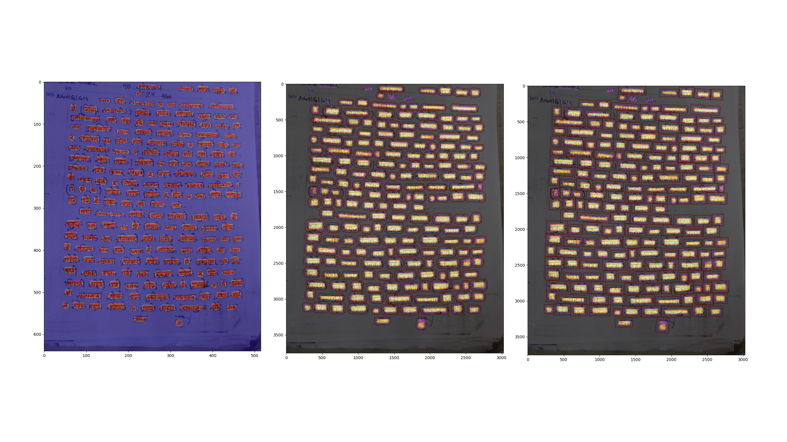

## Nepali Handwritten Text Detection


This repository contains the implementation of a text detection and localization system for Nepali handwritten text using the Differentiable Binarization Network (DBNet). The dataset used is the Nepali Handwriting Dataset (NHD) converted to the ICDAR 2015 format.

## Dataset

The Nepali Handwriting Dataset (NHD) is a collection of camera-captured images of Nepali handwritten text from various regions in Nepal. This dataset is available on Hugging Face and can be downloaded using:

```bash
git clone https://huggingface.co/datasets/Rajan/Nepali_Text_Detection_Dataset
```

## Setup

To set up the project, ensure you have the latest version of ```PyTorch``` installed. Then, install the required packages using:

```bash
pip install -r requirements.txt
```

## Training

To train the model, first download the dataset as mentioned above. Then, run the training script:

```bash
python main.py --train
```

## Inference

To perform inference on new images, use the following command:

```bash
python main.py --infer
```

## Configuration

All configurations for the project can be found in the `config.py` file.

## Logs

Here are some key metrics from the training logs:

- **Loss**: The total loss fluctuated around 0.7534 to 1.1091.
- **Accuracy**: Achieved an accuracy of around 0.936.
- **IOU**: The Intersection over Union (IoU) was approximately 0.836.
- **Test Metrics**: 
  - Recall: 0.907
  - Precision: 0.918
  - HMean: 0.912


## Acknowledgments

This project is based on the work of Sweekar Dahal's [Nepali Handwriting Dataset](https://github.com/dahalsweekar/Nepali-Handwritten-Dataset-Major-Collection). Special thanks to all contributors.


### Reference

- [DBNet.pytorch](https://github.com/WenmuZhou/DBNet.pytorch), thanks to [@WenmuZhou](https://github.com/WenmuZhou)

- [Real-time Scene Text Detection with Differentiable Binarization](https://arxiv.org/abs/1911.08947)
- [Evaluation metrics](https://github.com/Megvii-CSG/MegReader/blob/master/concern/icdar2015_eval)
- [DBNet.pytorch](https://github.com/WenmuZhou/DBNet.pytorch)
- [DBNet.keras](https://github.com/xuannianz/DifferentiableBinarization/)
- [Real-time-Text-Detection](https://github.com/SURFZJY/Real-time-Text-Detection)
- [PSENet.pytorch](https://github.com/whai362/PSENet)
- [deep-text-recognition-benchmark](https://github.com/clovaai/deep-text-recognition-benchmark)
- [volksdep](https://github.com/Media-Smart/volksdep)
- [TedEval](https://github.com/clovaai/TedEval)
- [torch2trt](https://github.com/NVIDIA-AI-IOT/torch2trt)
